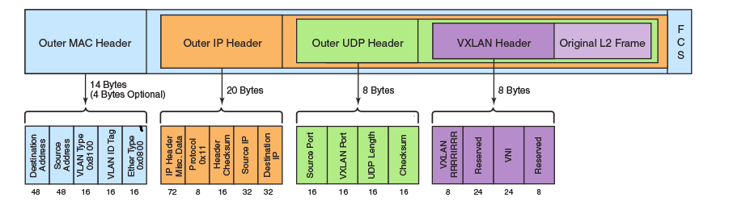

# Tìm hiểu về GRE và VXLAN 

**Mục lục:**

	1.Giới thiệu về Overlay network
 	
	2.Cơ chế hoạt động/vm-to-vm communication.
   	
	3.Giới thiệu về VXLAN và GRE.
   
   	4.Lab
   
   	5.Tổng kết   

########

**1. Giới thiệu về Overlay network**

- Trong những năm trở lại đây, các kỹ thuật ảo hóa và đám mây đã trở nên phổ biến hơn bao giờ hết. Trong trung tâm dữ liệu ảo hóa, mỗi máy chủ vật lý có thể chạy một hoặc nhiều máy chủ ảo dựa trên nền hypervisor.
- Kiến trúc mạng bây giờ phải đối mặt với nhu cầu kết nối giữa các máy chủ ảo với nhau, mỗi Virtual Machine (VM) yêu cầu 1 địa chỉ MAC duy nhất và 1 địa chỉ IP. Mặt khác việc di chuyển các máy chủ ảo từ máy chủ vật lý này sang máy chủ vật lý khác phải nhanh chóng, thuận lợi. Để đáp ứng các yêu cầu này, các kỹ thuật chồng lấn khác nhau (network overlay) được ra đời bao gồm: VXLAN, GRE, SPBV, TRILL, Fabric Path… Cụ thể trong khuôn khổ của bài viết này mình sẽ trình bày về VXLAN và GRE.
- Vậy Overlay network là gì?
- Overlay networking là công nghệ cho phép tạo ra các mạng ảo (logic) trên hệ thống mạng vật lý bên dưới (underlay network) mà không ảnh hưởng hoặc ảnh hưởng không đáng kể tới hạ tầng mạng bên dưới. Cụ thể hơn, với overlay network, ta có thể tạo ra các mạng ảo L2 trên nền hạ tầng mạng L3 network.
- Trong trung tâm dữ liệu ảo hóa, các mạng L2 này cần được cô lập thành các mạng riêng biệt, nếu như với môi trường với số lượng endpoint nhỏ, VLAN là giải pháp hoàn hảo. Tuy nhiên, khi mà số lượng máy ảo trên các máy chủ vật lý càng ngày càng tăng với số lượng lớn theo thời gian ( ví dụ trong môi trường cloud computing), kéo theo yêu cầu cô lập các mạng ảo này thì nảy sinh vấn đề vì số VLAN ID tối đa chỉ là 4096. 

-> Ta cần tới công nghệ overlay network như: GRE, VXLAN

**2. Cơ chế hoạt động **

- Khi cấu hình overlay network cho mạng ảo, GRE/VXLAN tạo nên các VTEP -(Virtual Tunnel Endpoints). Chúng ta có thể hình dung VTEP có hai giao diện – Một kết nối với mạng IP ở giữa và giao diện còn lại kết nối tới mạng nội bộ của các VM.

- Chức năng của Tunnel Endpoint là đóng gói VM trafic trong một IP header để gửi qua mạng IP bên dưới.

- Tư tưởng chung của các công nghệ như GRE hay VXLAN là khi một mạng overlay tạo nên thì sẽ có một ID duy nhất để định danh cho mạng đó đồng thời được sử dụng để đóng gói lưu lượng (traffic encapsulation). Mỗi gói tin giữa các VM trên các host vật lý khác nhau được đóng gói trên một host và gửi tới các host khác thông qua point-to-point GRE hoặc VXLAN tunnel. Khi gói tin tới host đích, các tunnel header sẽ bị loại bỏ (tại tunnel endpoint) và gói tin được chuyển tiếp tới bridge kết nối với VM.

- Sơ đồ sau đây thể hiện gói tin trước và sau khi được đóng gói bởi host.

- Theo hình mô tả ở trên, địa chỉ nguồn và đích trong outer IP header sẽ định danh cho endpoint của tunnel. Tất cả các host tham gia vào VXLAN/GRE thì hoạt động như một tunnel end points. Chức năng của Tunnel Endpoint là đóng gói VM trafic trong một IP header để gửi qua mạng IP bên dưới.

- Các địa chỉ nguồn và đích trong Inner IP header định danh cho các VM gửi và nhận payload.

**3. Một số công nghệ overlay network**

**3.1. VXLAN**

- Virtual Extensible LAN (VXLAN) là giao thức tunneling, thuộc giữa lớp 2 và lớp 3.

- VXLAN là giao thức sử dụng UDP (cổng 4789) để truyền thông và một segment ID độ dài 24 bit còn gọi là VXLAN network identifier (VNID). Chỉ các máy ảo trong cùng VXLAN segment mới có thể giao tiếp với nhau..

- VXLAN ID (VXLAN Network Identifier hoặc VNI) là 1 chuỗi 24-bits so với 12 bits của của VLAN ID. Do đó cung cấp hơn 16 triệu ID duy nhất ( giá trị này của VLAN: 4096 ).

- VXLAN frame format:

- Frame Ethernet thông thường bao gồm địa chỉ MAC nguồn, MAC đích, Ethernet type và thêm phần VLAN_ID (802.1q) nếu có. Đây là frame được đóng gói sử dụng VXLAN, thêm các header sau:
	
	- VXLAN header: 8 byte bao gồm các trường quan trọng sau:
		
		* Flags: 8 but, trong đó bit thứ 5 (I flag) được thiết lập là 1 để chỉ ra rằng đó là một frame có VNI có giá trị. 7 bit còn lại dùng dữ trữ được thiết lập là 0 hết.
		
		* VNI: 24 bit cung cấp định danh duy nhất cho VXLAN segment. Các VM trong các VXLAN khác nhau không thể giao tiếp với nhau. 24 bit VNI cung cấp lên tới hơn 16 triệu VXLAN segment trong một vùng quản trị mạng.

    - Outer UDP Header: port nguồn của Outer UDP được gán tự động và sinh ra bởi VTEP và port đích thông thường được sử dụng là port 4789 hay được sử dụng (có thể chọn port khác).

    - Outer IP Header: Cung cấp địa chỉ IP nguồn của VTEP nguồn kết nối với VM bên trong. Địa chỉ IP outer đích là địa chỉ IP của VTEP nhận frame.

    - Outer Ethernet Header: cung cấp địa chỉ MAC nguồn của VTEP có khung frame ban đầu. Địa chỉ MAC đích là địa chỉ của hop tiếp theo được định tuyến bởi VTEP
	
**3.2. GRE**

- GRE-Generic Routing Encapsulation là giao thức được phát triển đầu tiên bởi Cisco, Giao thức này sẽ đóng gói một số kiểu gói tin vào bên trong các IP tunnels để tạo thành các kết nối điểm-điểm (point-to-point) ảo. Các IP tunnel chạy trên hạ tầng mạng công cộng.

- Đây là một phương pháp đơn giản và hiệu quả để chuyển dữ liệu thông qua mạng public network, như Internet. GRE cho phép hai bên chia sẻ dữ liệu mà họ không thể chia sẻ với nhau thông qua mạng public network.

- GRE đóng gói dữ liệu và chuyển trực tiếp tới thiết bị mà de-encapsulate gói tin và định tuyến chúng tới đích cuối cùng. Gói tin và định tuyến chúng tới đích cuối cùng. GRE cho phép các switch nguồn và đích hoạt động như một kết nối ảo point-to-point với các thiết bị khác (bởi vì outer header được áp dụng với GRE thì trong suốt với payload được đóng gói bên trong).

-